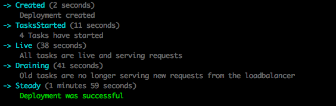
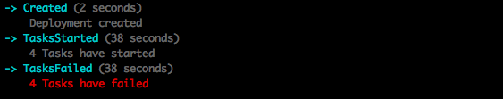

ECS Deployment Monitor
==============================

ECS Deployment Monitor will help you monitor the status of a deployment of a new task definition to an ECS Service. It does not do the deployment its self.

Its primary use case it to identify when a deploy fails. When containers in a task fail to start, ECS will terminate the task and start a new one. This is a great feature until you have a version of your application that will not start. In this scenario ECS will continue to start and stop tasks indefinitely, while leaving you none the wiser that your deploy has failed and an old version of your application is still running.

This monitor uses the healthy status on Target Group Targets to determine if a task is healthy. Thus use of an Application Load Balancer or Network Load Balancer is assumed and this monitor will not work without one.

Installation
------------

Install package with NPM. **NOTE:** We have moved the package under our
`bugcrowd` NPM organization - this will be the only package location maintained
going forward.

`npm install @bugcrowd/ecs-deployment-monitor --save`

Remove `--save` and add the `-g` flag to install globally if you wish to use the CLI version.

Ensure you run the monitor with the following IAM permissions:

```
ecs:DescribeContainerInstances
ecs:DescribeServices
ecs:DescribeTasks
ecs:ListContainerInstances
ecs:ListTasks
elasticloadbalancing:DescribeTargetHealth
```

Possible Deployment States
-----------------

### NotFound
A deployment matching the TaskDefinition was not found

### Usurped
A newer deployment has been created. This deployment is no longer being deployed.

### Created
Deployment has been created but no other activity has occurred.

### TasksStarted
New tasks have been started but they are not healthy yet.

### TasksFailed
The number of tasks which failed to start exceeded the defined failure threshold. Default 25%.

### Live
All new tasks have a healthy status as reported by targets on the Application Load Balancer. Tasks running with an old task definition revision are still running.

### Draining
No new requests will go to old tasks. Old tasks are draining.

### Steady
ECS Service has reached a steady state

CLI Usage
---------

If this module is installed globally an executable `ecs-deployment-monitor` should be available

### Options

   - cluster (required) - The arn of the ECS Cluster that is hosting the service
   - service-name (required) - The name of the ECS Service
   - task-definition (required) - The arn of the ECS Task Definition that was deployed
   - failure-threshold (optional) - The percentage of failed tasks from desired tasks which is triggers a failed deploy. Defaults to 25%. Expects a float. eg `.50` would represent a threshold of 50%

```
$ ecs-deployment-monitor \
    --cluster xxx \
    --service-name xxx \
    --task-definition xxx
```

### Example output



### Failed Deployments



Failed deployments will exit with a non-zero exit code. The following states are failed deploys:

   - TasksFailed will exit with an exit code of 1
   - NotFound will exit with an exit code of 2
   - Usurped will exit with an exit code of 3

Module Usage
------------

```js
const monitor = require('ecs-deployment-monitor');

let deployment = monitor({
  serviceName: 'name',
  clusterArn: 'arn::cluster',
  taskDefinitionArn: 'arn::task-definition',
});

deployment.on('error', (error) => console.log(error));
deployment.on('state', (state) => console.log(state));
deployment.on('end', (state) => console.log('DONE'));

```
